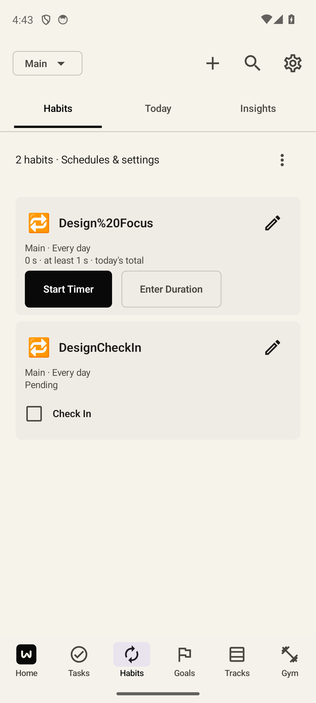
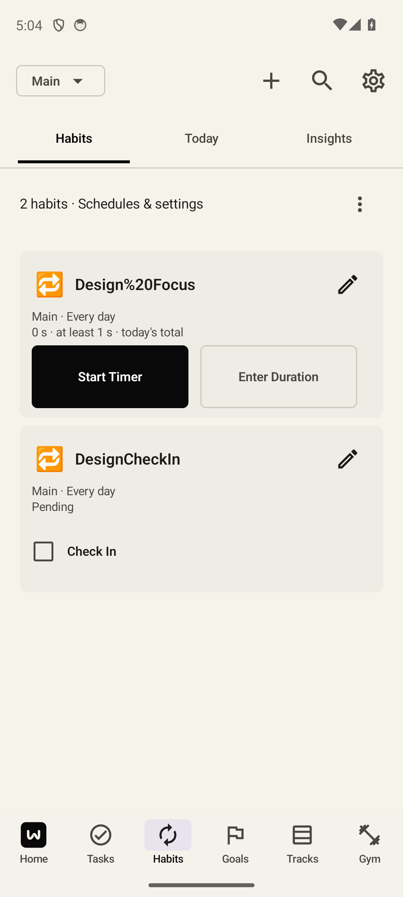
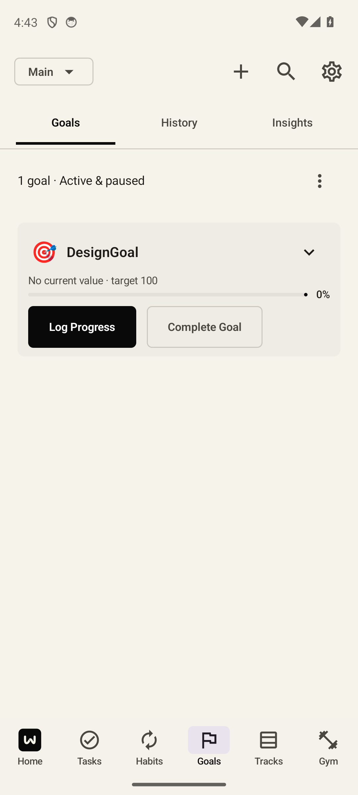
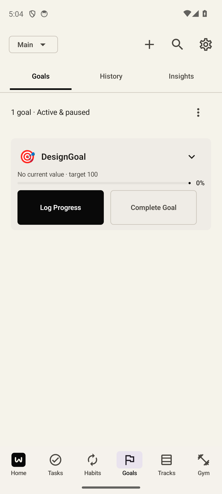

> Current refinement: [compact content-height controls](content-height/README.md), source2bdf4906. Earlier fixed-size visual acceptance below is superseded.

# Equal Habit and Goal activity buttons

**Accepted by the independent design consultant.** Related activity buttons now share label-independent width and height: width `min(160 dp × max(fontScale, 1), availableWidth)`, height `64 dp × max(fontScale, 1)`. Existing leading rows wrap. Primary/secondary styling, timer/logging/completion meanings, callbacks and saving guards remain. The Check In cell stays one checkbox toggle with its original square and label gap.

The six production edits reuse existing controls for card actions, numeric inspector actions, opted-in inspector docks, logging/correction footers and completion confirmation. Ordinary definition editors retain their defaults.

| Same fixtures/configuration | Before | After |
| --- | --- | --- |
| Compact Habits |  |  |
| Compact Goals |  |  |
| Wide Habits | [Before](design/before-habits-wide.png) | [After](design/after-habits-wide.png) |
| Wide Goals | [Before](design/before-goal-wide.png) | [After](design/after-goal-wide.png) |
| Native 200% Habits | [Before](design/before-habits-large.png) | [After](design/after-habits-large.png) |
| Native 200% Goals | [Before](design/before-goal-large.png) | [After](design/after-goal-large.png) |
| Duration footer | [Before](design/before-duration-form-compact.png) | [After](design/after-duration-form-compact.png) |
| Goal footer | [Before](design/before-goal-form-compact.png) | [After](design/after-goal-form-compact.png) |

Design captures at density 420 measure 420×168 px normally and 840×336 at 200%. Before, widths varied from 168 px for Cancel to 349 px for Complete Goal. Fully visible Check In evidence: [wide](design/after-checkin-wide.png), [200%](design/after-checkin-large.png). The CSV marks the partial wide overview clipped.

Final critique accepted actual short/long labels, leading activity groups, hierarchy, checkbox spacing and readable wrapping. Additional accepted originals: [200% long inspector label](qa/native/final-large-replay/action-sizing.qa.outside-inspector.large.png), [200% correction actions](qa/native/final-large-replay/action-sizing.qa.goal-correction-footer.large.png), [200% confirmation](qa/native/final-large-replay/action-sizing.qa.goal-confirmation.large.png), [keyboard](implementation/native/action-layout.qa.duration-keyboard.large.png), and [unobscured wide completion-count Goal](implementation/native-wide-card-correction/goal-consistency-wide-unobscured.png). The consultant rejected the older onboarding-obscured card capture; it is retained and explicitly excluded.

| Focused validation | Result |
| --- | --- |
| Compact sizing/readability and saved actions | Passed 1/1 |
| Wide sizing/readability and saved actions | Passed 1/1 |
| Native 200% sizing/readability, wrapping and Cancel | Passed 1/1 |
| Native 200% keyboard, Back/Cancel, draft recreation and saved duration | Passed 1/1 |
| Affected readiness, source guards, debug app/test build | Passed |
| Lint | 0 errors, 90 warnings, 15 hints |

Native tests check common dimensions, complete labels/no ellipsis, actual glyph fit, actual Android font scale, leading placement, 48 dp minimum targets, non-overlap, persistence and Cancel. Compact uses 1080×2400 / density 420; native wide uses 1920×1200 / density 240. Prior valid passes were preserved; no full suite or unrelated JVM tests were rerun.

Raw failed attempts remain recorded. They were test setup/measurement issues: a generic Compose width flag compared constrained paragraph width with natural text width although all glyphs fit; an unrelated viewport-clipped control upset capture validation; incompatible/incomplete Goal drafts needed the existing valid Consistency contract; and an off-screen 200% gesture needed exact-target scrolling. Final glyph checks, validated target 3/week/12-period fixture and visible target gestures passed. Production stayed unchanged throughout those corrections.

App SHA256: `b264e33f81f2d3e6021d5da8f1202bc02797f4e90a4a267d340afb33bbd954a8`. [Build/provenance receipts](implementation/README.md), [QA results](qa/README.md), [paired design receipt](design/README.md). Base: `16f1146859614146798745885f7a7726f482d495`. The prior user-modified phone receipt is preserved. Emulator settings are restored. This refinement is **not installed on Nick's phone**; physical-device/TalkBack behavior was not recertified.
